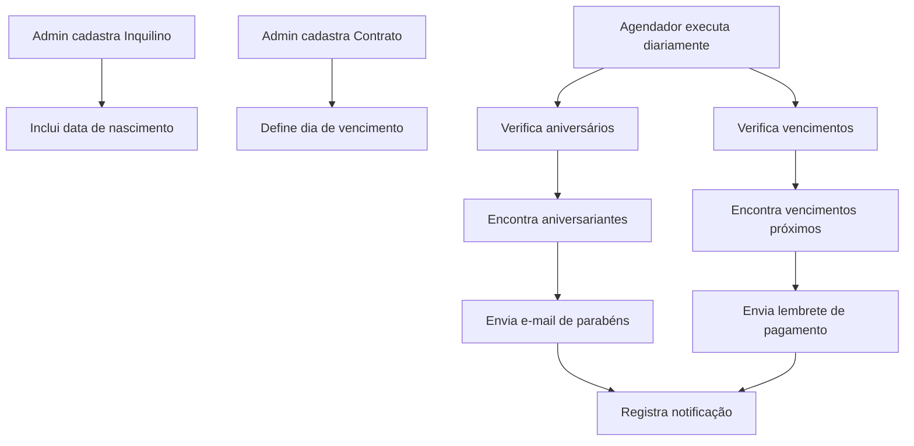

# 🔗 Integração do Sistema de Notificações Automáticas com Dados

## 📋 Situação Atual

### ✅ **O que já está implementado:**

1. **Sistema de E-mails Funcionando:**
   - ✅ Templates de e-mail profissionais
   - ✅ Configuração SMTP (Gmail)
   - ✅ Envio de e-mails funcionando 100%
   - ✅ Agendador automático (cron jobs)

2. **Estrutura de Dados:**
   - ✅ Modelo `Inquilino` (usuários)
   - ✅ Modelo `Contrato` (contratos de locação)
   - ✅ Modelo `Imovel` (imóveis)
   - ✅ Interface administrativa para gerenciar contratos

### ❌ **O que está faltando:**

## 🚨 Problemas Identificados

### 1. **Campo Data de Nascimento Ausente**
**Problema:** O modelo `Inquilino` não possui campo `dataNascimento`
```javascript
// ATUAL - Inquilino.js (SEM data de nascimento)
const InquilinoSchema = new mongoose.Schema({
  email: String,
  senha: String,
  nome: String,
  telefone: String,
  // ❌ FALTA: dataNascimento
});
```

**Impacto:** Sistema não consegue enviar parabéns de aniversário

### 2. **Campo Data de Vencimento de Boleto Ausente**
**Problema:** O modelo `Contrato` não possui campo específico para vencimento mensal
```javascript
// ATUAL - Contrato.js (SEM vencimento mensal)
const ContratoSchema = new mongoose.Schema({
  dataInicio: Date,
  dataFim: Date,
  valorAluguel: Number,
  // ❌ FALTA: dataVencimentoMensal ou diaVencimento
});
```

**Impacto:** Sistema não consegue enviar lembretes de vencimento de aluguel

### 3. **Lógica de Busca Não Implementada**
**Problema:** As funções de busca estão simuladas
```javascript
// ATUAL - agendadorNotificacoes.js
async verificarAniversarios() {
  // ❌ SIMULAÇÃO - não busca dados reais
  const aniversariantes = []; // Substitua pela busca real
}
```

## 🛠️ Soluções Necessárias

### 1. **Adicionar Campo Data de Nascimento**
```javascript
// SOLUÇÃO - Atualizar Inquilino.js
const InquilinoSchema = new mongoose.Schema({
  // ... campos existentes
  dataNascimento: {
    type: Date,
    required: false // Opcional para inquilinos existentes
  },
  idade: {
    type: Number,
    required: false
  }
});
```

### 2. **Adicionar Campo Vencimento Mensal**
```javascript
// SOLUÇÃO - Atualizar Contrato.js
const ContratoSchema = new mongoose.Schema({
  // ... campos existentes
  diaVencimento: {
    type: Number,
    required: true,
    min: 1,
    max: 31,
    default: 10 // Dia 10 de cada mês
  },
  proximoVencimento: {
    type: Date,
    required: true
  }
});
```

### 3. **Implementar Lógicas de Busca Reais**
```javascript
// SOLUÇÃO - Implementar buscas reais
async verificarAniversarios() {
  const hoje = new Date();
  const diaHoje = hoje.getDate();
  const mesHoje = hoje.getMonth() + 1;

  const aniversariantes = await Inquilino.find({
    $expr: {
      $and: [
        { $eq: [{ $dayOfMonth: "$dataNascimento" }, diaHoje] },
        { $eq: [{ $month: "$dataNascimento" }, mesHoje] }
      ]
    }
  });
}
```

## 🎯 Plano de Implementação

### **Fase 1: Atualizar Modelos de Dados**
1. ✅ Adicionar `dataNascimento` ao modelo `Inquilino`
2. ✅ Adicionar `diaVencimento` ao modelo `Contrato`
3. ✅ Criar migration para dados existentes

### **Fase 2: Atualizar Interfaces Administrativas**
1. ✅ Adicionar campo data de nascimento no cadastro de inquilinos
2. ✅ Adicionar campo dia de vencimento no cadastro de contratos
3. ✅ Permitir edição desses campos

### **Fase 3: Implementar Lógicas de Busca**
1. ✅ Implementar busca real de aniversariantes
2. ✅ Implementar busca real de vencimentos
3. ✅ Implementar busca real de contratos vencendo

### **Fase 4: Testar Sistema Completo**
1. ✅ Testar com dados reais
2. ✅ Verificar agendamentos automáticos
3. ✅ Validar envio de e-mails

## 📊 Fluxo de Dados Completo



## 🔧 Configurações Necessárias

### **1. Área Administrativa**
- ✅ Campo "Data de Nascimento" no cadastro de inquilinos
- ✅ Campo "Dia de Vencimento" no cadastro de contratos
- ✅ Validações de data
- ✅ Campos opcionais para dados existentes

### **2. Agendamentos Automáticos**
- ✅ **Aniversários:** Todos os dias às 9h
- ✅ **Vencimentos:** Todos os dias às 8h (7 dias antes)
- ✅ **Contratos:** Segundas-feiras às 10h (60 dias antes)
- ✅ **Reajustes:** Conforme data de aniversário do contrato

### **3. Sincronização de Dados**
- ✅ Dados alimentados via área administrativa
- ✅ Validações de integridade
- ✅ Logs de notificações enviadas
- ✅ Controle de duplicatas

## 🎯 Próximos Passos

1. **Implementar campos faltantes nos modelos**
2. **Atualizar interfaces administrativas**
3. **Implementar lógicas de busca reais**
4. **Testar sistema completo**
5. **Documentar processo para o usuário**

## 📝 Observações Importantes

- ⚠️ **Dados existentes:** Campos novos serão opcionais para não quebrar dados existentes
- 🔄 **Migração:** Será necessário atualizar contratos e inquilinos existentes
- 📧 **E-mails:** Sistema já funciona, só precisa dos dados corretos
- 🕐 **Agendamentos:** Já configurados, só precisam das buscas reais

---

**Status:** 🟡 Parcialmente implementado - Necessita integração com dados reais
**Prioridade:** 🔴 Alta - Sistema de notificações é funcionalidade crítica